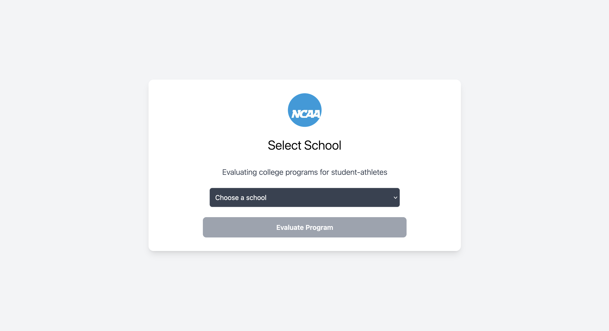
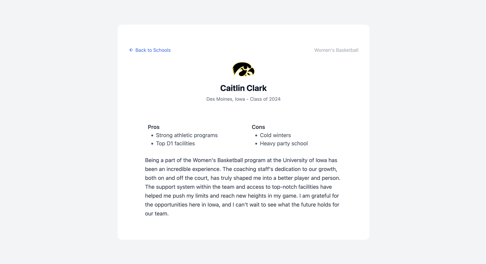

## OpenAI <> NCAA Concept Project

This concept project presents reviews of NCAA athletic programs for a given market.

Link: [Live Demo](https://replicant-project.onrender.com/)  

> Note: Please allow up to 30 seconds for the site to load - it's hosted for free. 

---

## Functionality

### 1. **Landing Page**  
Select a school and sport you're interested in learning more about and click Evaluate Program.

### 2. **View Data**  
The application then use the Chat Completions API to send a request and recieve a summarizes the program.

## Housekeeping

Note, I am using `gpt-3.5-turbo` here for eas of use purporses. 